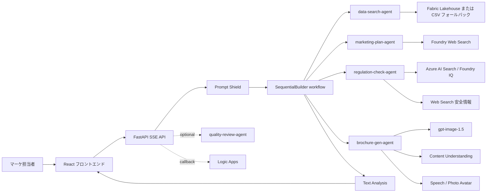

# 旅行マーケティング AI マルチエージェントパイプライン

[English README](README.md)

自然言語の指示から、旅行向けの企画書、規制チェック済みの販促テキスト、ブローシャ、画像、任意の品質レビュー結果を生成するアプリケーションです。

## 現在の実装範囲

- React 19 フロントエンド: SSE チャット、成果物プレビュー、会話履歴、リプレイ、多言語 UI、音声入力 UI
- FastAPI バックエンド: レート制限、`/api/health`、`/api/ready`、静的ファイル配信
- 主処理の 4 エージェント: データ検索、施策生成、規制チェック、販促物生成
- Azure 構成時のみ追加で動くオプションの品質レビューエージェント
- Microsoft Foundry、Content Safety、Azure AI Search、Cosmos DB、Logic Apps、Content Understanding、Speech / Photo Avatar との連携
- `azd` + Bicep による Azure Container Apps、ACR、APIM、Functions、Key Vault、Cosmos DB、VNet、Log Analytics、Application Insights の構築

## 実装上の現在地

- Azure 接続時の実行経路は、FastAPI から Microsoft Foundry の project endpoint を `DefaultAzureCredential` で直接呼び出します。
- APIM AI Gateway は Azure 側に作成されますが、アプリ本体の推論トラフィックはまだ `APIM_GATEWAY_URL` を経由していません。
- Azure モードの `POST /api/chat` は 4 エージェントを途中停止なしで最後まで実行します。
- `approval_request` SSE イベントは、現状ではモック / デモ経路と承認継続経路で主に使われます。
- ナレッジベースの実行時検索は Managed Identity を使いますが、`scripts/setup_knowledge_base.py` には初期投入用の API キー経路も残しています。

Azure アーキテクチャ図と補足は [docs/azure-architecture.md](docs/azure-architecture.md) を参照してください。

## アーキテクチャ概要



## クイックスタート

### 前提条件

- Python 3.14+
- Node.js 22+
- [uv](https://docs.astral.sh/uv/)
- Azure にデプロイする場合は Azure CLI と Azure Developer CLI (`azd`)

### ローカルセットアップ

```bash
uv sync
cd frontend && npm ci && cd ..
cp .env.example .env
```

`.env` に Azure の接続情報を入れると実 Azure モードで動作します。`AZURE_AI_PROJECT_ENDPOINT` を設定しない場合はモック / デモ動作になります。

### ローカル起動

```bash
uv run uvicorn src.main:app --reload --port 8000
cd frontend && npm run dev
```

- フロントエンド: `http://localhost:5173`
- バックエンド: `http://localhost:8000`

### 検証コマンド

```bash
uv run pytest
uv run ruff check .
cd frontend && npm run lint
cd frontend && npx tsc --noEmit
cd frontend && npm run build
```

### Azure デプロイ

```bash
azd auth login
azd up
```

`azd up` の後に必要なモデル追加や Azure AI Search 設定、Speech / Logic Apps の環境変数投入は [docs/azure-setup.md](docs/azure-setup.md) を参照してください。

## 主要な環境変数

| 変数名 | 必須 | 用途 |
|---|---|---|
| `AZURE_AI_PROJECT_ENDPOINT` | 本番 | Microsoft Foundry project endpoint |
| `CONTENT_SAFETY_ENDPOINT` | 本番 | Content Safety / Text Analysis のエンドポイント |
| `MODEL_NAME` | 任意 | テキスト推論の deployment 名。既定値は `gpt-5-4-mini` |
| `ENVIRONMENT` | 任意 | `development`、`staging`、`production` |
| `COSMOS_DB_ENDPOINT` | 任意 | 会話履歴保存。未設定時はインメモリ |
| `FABRIC_SQL_ENDPOINT` | 任意 | Fabric Lakehouse SQL endpoint |
| `CONTENT_UNDERSTANDING_ENDPOINT` | 任意 | PDF 解析用 |
| `SPEECH_SERVICE_ENDPOINT` | 任意 | Speech / Photo Avatar 用 |
| `SPEECH_SERVICE_REGION` | 任意 | Speech リージョン |
| `LOGIC_APP_CALLBACK_URL` | 任意 | 承認継続後の Logic Apps HTTP トリガー |
| `APPLICATIONINSIGHTS_CONNECTION_STRING` | 任意 | Application Insights の接続文字列 |

詳細は [.env.example](.env.example) を参照してください。

## ディレクトリ構成

```text
src/                 FastAPI アプリ、エージェント、ワークフロー、ミドルウェア
frontend/            React UI、SSE フック、成果物ビュー、会話履歴
functions/           Azure Functions ベースの補助ツール
infra/               Azure リソースの Bicep テンプレート
data/                デモデータとリプレイ用データ
regulations/         ナレッジベース投入元の規制文書
tests/               バックエンドテスト
docs/                API、デプロイ、Azure セットアップ、アーキテクチャ資料
```

## ドキュメント

- [docs/azure-architecture.md](docs/azure-architecture.md): 現在の Azure 構成図と補足
- [docs/api-reference.md](docs/api-reference.md): REST API と SSE の現行仕様
- [docs/deployment-guide.md](docs/deployment-guide.md): ローカル、Docker、CI/CD、Azure デプロイの説明
- [docs/azure-setup.md](docs/azure-setup.md): Azure 構築と post-provision 手順
- [docs/requirements_v3.7.md](docs/requirements_v3.7.md): 目標要件ドキュメント
