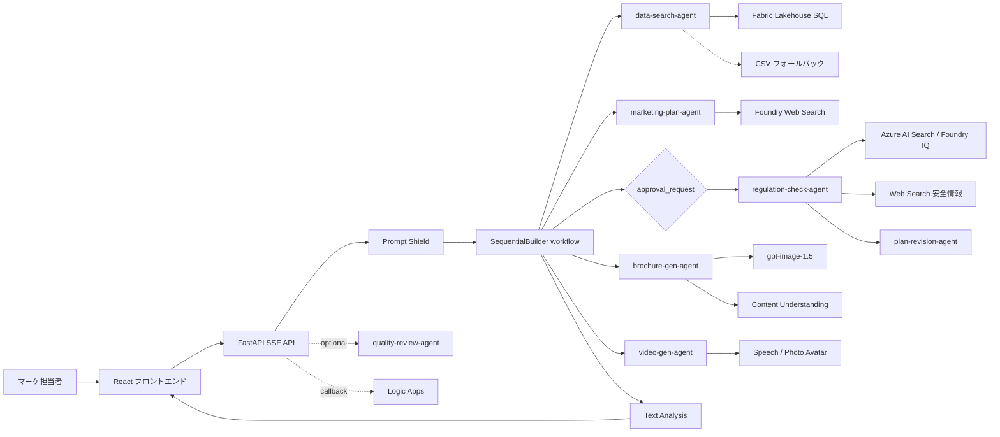

# 旅行マーケティング AI マルチエージェントパイプライン

[English README](README.md)

自然言語の指示から、旅行向けの企画書、規制チェック済みの販促テキスト、ブローシャ、画像、任意の品質レビュー結果を生成するアプリケーションです。

## 現在の実装範囲

- React 19 フロントエンド: SSE チャット、成果物プレビュー、会話履歴復元（Cosmos DB から再推論なし）、リプレイ、多言語 UI（日英中）、音声入力（Voice Live + MSAL.js 認証 / Web Speech API フォールバック）、モデルセレクター（4 モデル）、ダークモード（WCAG AA コントラスト対応）
- FastAPI バックエンド: レート制限、`/api/health`、`/api/ready`、静的ファイル配信
- パイプラインの 7 エージェント: データ検索（Fabric Lakehouse SQL + CSV フォールバック）、施策生成、規制チェック、企画書修正、販促物生成（顧客向け HTML）、動画生成（Photo Avatar）、品質レビュー。ユーザーには 5 ステップ表示
- Azure 構成時のみ追加で動くオプションの品質レビューエージェント
- Fabric Lakehouse 連携: pyodbc + Azure AD トークン認証によるリアルタイム売上・レビューデータ検索
- Photo Avatar 動画生成: `casual-sitting` スタイル、MP4/H.264、ソフト字幕埋め込み
- Voice Live API: MSAL.js による Entra アプリ登録認証、Web Speech API への自動フォールバック
- Code Interpreter の自動検出とグレースフルフォールバック
- Microsoft Foundry、Content Safety、Azure AI Search、Cosmos DB、Logic Apps、Content Understanding、Speech / Photo Avatar、Fabric Lakehouse との連携
- `azd` + Bicep による Azure Container Apps、ACR、APIM、Key Vault、Cosmos DB、VNet、Log Analytics、Application Insights の構築

## 実装上の現在地

- Azure 接続時の実行経路は、FastAPI から Microsoft Foundry の project endpoint を `DefaultAzureCredential` で直接呼び出します。
- APIM AI Gateway は `scripts/postprovision.py` で自動構成され、Foundry AI Gateway 接続（`travel-ai-gateway`）の作成とトークン制限ポリシーの適用を行います。
- Azure モードの `POST /api/chat` は Agent2（施策生成）完了後に `approval_request` を返し、承認後に Agent3a → Agent3b → Agent4 → Agent5 を続行します。
- パイプラインは 5 ユーザー向けステップで、内部は 7 エージェントで構成されています（Agent3a+3b がステップ 4、Agent4+5 がステップ 5 を共有）。
- Agent1 は Fabric Lakehouse に pyodbc + Azure AD トークン認証（`SQL_COPT_SS_ACCESS_TOKEN`）で接続します。Fabric SQL endpoint が利用できない場合は CSV フォールバックを使います。
- Agent4 は顧客向けブローシャを生成し、KPI・売上目標・社内分析を含めません。
- Agent5（動画生成）は Photo Avatar で `casual-sitting` スタイル、`ja-JP-NanamiNeural` 音声の販促動画を MP4/H.264 で出力します。
- Agent6（品質レビュー）は `GitHubCopilotAgent` + `PermissionHandler.approve_all` で自動権限承認を使用します。
- Code Interpreter は実行時に自動検出され、利用不可の場合はグレースフルにフォールバックします（`ENABLE_CODE_INTERPRETER=false` で無効化可）。
- フロントエンドのモデルセレクターで `gpt-5-4-mini`（既定）、`gpt-5.4`、`gpt-4-1-mini`、`gpt-4.1` を選択できます。
- Voice Live API は MSAL.js による Entra アプリ登録認証です。`VoiceInput` コンポーネントは Voice Live + Web Speech API のデュアルモードで動作します。
- 会話履歴は Cosmos DB から `restoreConversation()` で復元され、再推論は行いません。
- ナレッジベースの実行時検索は Managed Identity を使いますが、`scripts/setup_knowledge_base.py` には初期投入用の API キー経路も残しています。

Azure アーキテクチャ図と補足は [docs/azure-architecture.md](docs/azure-architecture.md) を参照してください。詳細な構成図は [docs/architecture.drawio](docs/architecture.drawio) にもあります。

## アーキテクチャ概要



## クイックスタート

### 前提条件

- Python 3.14+
- Node.js 22+
- [uv](https://docs.astral.sh/uv/)
- Azure にデプロイする場合は Azure CLI と Azure Developer CLI (`azd`)

### ローカルセットアップ

```bash
uv sync
cd frontend && npm ci && cd ..
cp .env.example .env
```

`.env` に Azure の接続情報を入れると実 Azure モードで動作します。`AZURE_AI_PROJECT_ENDPOINT` を設定しない場合はモック / デモ動作になります。

### ローカル起動

```bash
uv run uvicorn src.main:app --reload --port 8000
cd frontend && npm run dev
```

- フロントエンド: `http://localhost:5173`
- バックエンド: `http://localhost:8000`

### 検証コマンド

```bash
uv run pytest
uv run ruff check .
cd frontend && npm run lint
cd frontend && npx tsc --noEmit
cd frontend && npm run build
```

### Azure デプロイ

```bash
azd auth login
azd up
```

`azd up` の後、`scripts/postprovision.py` が AI Gateway 接続と APIM ポリシーを自動構成します。残りの手動設定（Azure AI Search や Speech / Logic Apps の環境変数投入）は [docs/azure-setup.md](docs/azure-setup.md) を参照してください。

## 主要な環境変数

| 変数名 | 必須 | 用途 |
|---|---|---|
| `AZURE_AI_PROJECT_ENDPOINT` | 本番 | Microsoft Foundry project endpoint |
| `CONTENT_SAFETY_ENDPOINT` | 本番 | Content Safety / Text Analysis のエンドポイント |
| `MODEL_NAME` | 任意 | テキスト推論の deployment 名。既定値は `gpt-5-4-mini`。フロントエンドのモデルセレクターでは `gpt-5.4`、`gpt-4-1-mini`、`gpt-4.1` も選択可 |
| `ENVIRONMENT` | 任意 | `development`、`staging`、`production` |
| `COSMOS_DB_ENDPOINT` | 任意 | 会話履歴保存。未設定時はインメモリ |
| `FABRIC_SQL_ENDPOINT` | 推奨 | Fabric Lakehouse SQL endpoint（リアルタイムデータ検索、未設定時は CSV フォールバック） |
| `CONTENT_UNDERSTANDING_ENDPOINT` | 任意 | PDF 解析用 |
| `SPEECH_SERVICE_ENDPOINT` | 任意 | Speech / Photo Avatar 動画生成用 |
| `SPEECH_SERVICE_REGION` | 任意 | Speech リージョン |
| `VOICE_SPA_CLIENT_ID` | 任意 | Voice Live の MSAL.js 認証用 Entra アプリ登録クライアント ID |
| `AZURE_TENANT_ID` | 任意 | Voice Live 認証用 Entra テナント ID |
| `LOGIC_APP_CALLBACK_URL` | 任意 | 承認継続後の Logic Apps HTTP トリガー |
| `APPLICATIONINSIGHTS_CONNECTION_STRING` | 任意 | Application Insights の接続文字列 |

詳細は [.env.example](.env.example) を参照してください。

## ディレクトリ構成

```text
src/                 FastAPI アプリ、エージェント、ワークフロー、ミドルウェア
frontend/            React UI、SSE フック、成果物ビュー、会話履歴
infra/               Azure リソースの Bicep テンプレート
data/                デモデータとリプレイ用データ
regulations/         ナレッジベース投入元の規制文書
tests/               バックエンドテスト
docs/                API、デプロイ、Azure セットアップ、アーキテクチャ資料
```

## ドキュメント

- [docs/azure-architecture.md](docs/azure-architecture.md): 現在の Azure 構成図と補足
- [docs/api-reference.md](docs/api-reference.md): REST API と SSE の現行仕様
- [docs/deployment-guide.md](docs/deployment-guide.md): ローカル、Docker、CI/CD、Azure デプロイの説明
- [docs/azure-setup.md](docs/azure-setup.md): Azure 構築と post-provision 手順
- [docs/requirements_v3.7.md](docs/requirements_v3.7.md): 目標要件ドキュメント
