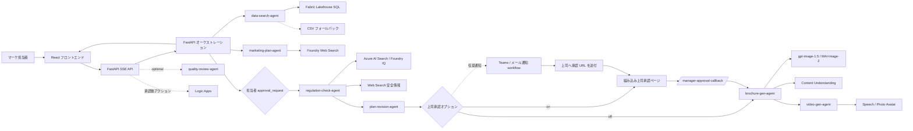

# 旅行マーケティング AI マルチエージェントパイプライン

[English README](README.md)

自然言語の指示から、旅行向けの企画書、規制チェック済みの販促テキスト、ブローシャ、画像、任意の品質レビュー結果を生成するアプリケーションです。

## 現在の実装範囲

- React 19 フロントエンド: SSE チャット、成果物プレビュー、会話履歴復元（Cosmos DB から再推論なし）、リプレイ、多言語 UI（日英中）、音声入力（Voice Live + MSAL.js 認証 / Web Speech API フォールバック）、モデルセレクター（4 モデル）、ダークモード（WCAG AA コントラスト対応）、専用の評価タブ、版比較カード付きの改善ラウンド比較、生成中や 2 回目の上司承認待ちでも確定版を参照できる成果物バージョン切替、現在版と過去版を並べる上司承認ポータル
- FastAPI バックエンド: レート制限、`/api/health`、`/api/ready`、静的ファイル配信、`/api/evaluate` 品質評価 API
- パイプラインの 7 エージェント: データ検索（Fabric Lakehouse SQL + CSV フォールバック）、施策生成、規制チェック、企画書修正、販促物生成（顧客向け HTML）、動画生成（Photo Avatar）、品質レビュー。ユーザーには 5 ステップ表示で、企画書修正後に組み込み承認ページ経由の任意の上司承認ゲートを挟めます
- Fabric データアクセス: `FABRIC_DATA_AGENT_URL` がある場合は Fabric Data Agent Published URL を優先し、利用不可時は Fabric Lakehouse SQL、その次に CSV へフォールバック
- Foundry Evaluation 連携: Built-in 指標（Relevance / Coherence / Fluency）、業務向けカスタム指標（旅行業法準拠、コンバージョン期待度、訴求力、差別化、KPI 妥当性、ブランドトーン）、Foundry ポータル記録、改善ラウンド比較を前提にした評価起点の再改善
- Azure 構成時のみ追加で動くオプションの品質レビューエージェント
- Photo Avatar 動画生成: HD voice + SSML ナレーション、イントロジェスチャー、`casual-sitting` スタイル、MP4/H.264、ソフト字幕埋め込み
- Voice Live API: MSAL.js による Entra アプリ登録認証、Web Speech API への自動フォールバック
- Code Interpreter の自動検出とグレースフルフォールバック
- Microsoft Foundry、Azure AI Search、Cosmos DB、承認後アクション用 Logic Apps、組み込みの上司承認ページ、任意の Teams / メール通知 workflow、Content Understanding、Speech / Photo Avatar、Fabric Lakehouse との連携
- `azd` + Bicep による Azure Container Apps、ACR、APIM、Key Vault、Cosmos DB、VNet、Log Analytics、Application Insights の構築

## 実装上の現在地

- Azure 接続時の実行経路は、FastAPI から Microsoft Foundry の project endpoint を `DefaultAzureCredential` で直接呼び出します。コンテンツフィルタはモデル配備側に寄せ、アプリ側では明らかな指示上書きだけを軽量ガードで弾きます。
- APIM AI Gateway は `scripts/postprovision.py` で自動構成され、Foundry AI Gateway 接続（`travel-ai-gateway`）の作成と、生成された `foundry-*` API への `llm-token-limit` / `llm-emit-token-metric` ポリシー適用を行います。
- APIM 側の content safety は現行構成では有効化していません。Prompt Shields、document or indirect attack 対策、tool response 介入、Spotlighting は Azure / Foundry 側で明示割当した場合にのみ有効になる追加ガードレールとして扱います。
- Azure モードの `POST /api/chat` は Agent2（施策生成）完了後に担当者向け `approval_request` を返します。
- 担当者承認後は Agent3a → Agent3b を実行し、`manager_approval_enabled=true` の場合は組み込みの上司承認ページ URL を発行して Agent4 → Agent5 の前で待機します。
- `MANAGER_APPROVAL_TRIGGER_URL` が設定されていれば、その URL を上司へ送る通知 workflow も併せて呼び出します。未設定または送信失敗時は、担当者が生成済みリンクを共有すればそのまま運用できます。
- Bicep が自動作成するのは承認後アクション用の Logic Apps だけです。上司承認そのものは組み込みページで処理し、任意の外部通知 workflow の契約は [docs/manager-approval-workflow.md](docs/manager-approval-workflow.md) にまとめています。
- パイプラインは 5 ユーザー向けステップで、内部は 7 エージェントで構成されています（Agent3a+3b がステップ 4、Agent4+5 がステップ 5 を共有）。
- Agent1 はまず Fabric Data Agent Published URL（`FABRIC_DATA_AGENT_URL`）を AAD 認証付きの Assistants 互換エンドポイントとして利用し、利用できない場合は Fabric Lakehouse SQL の pyodbc 接続（`SQL_COPT_SS_ACCESS_TOKEN`）、最後に CSV へフォールバックします。
- Agent4 は顧客向けブローシャを生成し、KPI・売上目標・社内分析を含めません。
- Agent5（動画生成）は Photo Avatar で SSML ベースのナレーションを組み立て、`ja-JP-Nanami:DragonHDLatestNeural` 音声とイントロジェスチャー付きの販促動画を MP4/H.264 で出力します。
- Agent6（品質レビュー）は `GitHubCopilotAgent` + `PermissionHandler.approve_all` で自動権限承認を使用します。
- Code Interpreter は実行時に自動検出され、利用不可の場合はグレースフルにフォールバックします（`ENABLE_CODE_INTERPRETER=false` で無効化可）。
- Azure Functions MCP は現行デプロイには含めません。AI Gateway 管理下に置きたい新規リモートツールやコネクタ分離が必要になった段階で、Phase2 の拡張として扱います。
- フロントエンドのモデルセレクターで `gpt-5-4-mini`（既定）、`gpt-5.4`、`gpt-4-1-mini`、`gpt-4.1` を選択できます。
- `POST /api/evaluate` は `azure-ai-evaluation` の Built-in 評価器（Relevance / Coherence / Fluency）と、code-based / prompt-based のカスタム評価器を組み合わせ、成功時は Foundry ポータル URL も返します。
- 評価結果からの改善は `POST /api/chat` にフィードバック文を戻して企画書を再生成し、新しい `approval_request` を返します。承認すると規制チェック以降の成果物も再生成されます。
- フロントエンドは完了ごとに成果物スナップショットを保持し、`VersionSelector` で企画書・ブローシャ・画像・動画をまとめて切り替えます。
- 最終承認後は、ブローシャと画像の生成が終わった時点でユーザー向けには完了扱いになります。動画のポーリング、品質レビュー、承認後アクション用 Logic Apps は background update として続行され、同じ会話履歴に追記されます。
- 新しい版の生成中や 2 回目の上司承認待ちでは、右ペインは既定で最新の確定版を表示し続けます。生成中チップから pending 中のライブ版へ切り替えられ、戻っても以前の確定版は失われません。
- 評価パネルの比較はメインの成果物プレビューを切り替えずに行います。比較領域の上部には「現在の版」と「比較対象版」の両方を要約カードで表示します。
- 組み込みの上司承認ポータルは `GET /api/chat/{thread_id}/manager-approval-request` から `current_version` と `previous_versions` を受け取り、今回の修正版と過去の確定版を横並びで比較表示します。永続化が追いつかないタイミングでも、バックエンドは pending approval context 側に比較データを保持して表示を維持します。
- 評価レスポンスに `task_adherence` が含まれていても、現状はノイズが大きいため、フロントエンドではスコア表示、比較差分、総合サマリ、改善フィードバック生成から除外しています。
- Voice Live API は MSAL.js による Entra アプリ登録認証です。`VoiceInput` コンポーネントは Voice Live + Web Speech API のデュアルモードで動作します。
- 会話履歴は Cosmos DB から `restoreConversation()` で復元され、再推論は行いません。
- ナレッジベースの実行時検索は Managed Identity を使いますが、`scripts/setup_knowledge_base.py` には初期投入用の API キー経路も残しています。

Azure アーキテクチャ図と補足は [docs/azure-architecture.md](docs/azure-architecture.md) を参照してください。詳細な構成図は [docs/architecture.drawio](docs/architecture.drawio) にもあります。

## Azure 実機スナップショット

- `2026-04-04` 時点で、Azure デプロイは `/api/health=ok`、`/api/ready=ready` を確認済みです。
- ランタイムのテキスト deployment は `gpt-5-4-mini`、評価用 deployment は `gpt-4-1-mini` を利用しています。
- 画像生成はメイン Foundry project 上の `gpt-image-1.5` が稼働中で、`MAI-Image-2` は任意の別リソース構成です。
- Fabric は workspace `TeamD`、capacity `teamdfabric`（F64, Japan East）、Lakehouse `Travel_Lakehouse` で稼働し、アプリには SQL endpoint が設定済みです。Fabric Data Agent は設定時のみ優先経路として利用します。
- APIM AI Gateway と `travel-ai-gateway` 接続、トークン制限ポリシーは `scripts/postprovision.py` により構成済みです。
- 承認後アクション用 Logic Apps callback は有効です。上司通知 workflow は `MANAGER_APPROVAL_TRIGGER_URL` 経由の任意構成として分離しています。

## アーキテクチャ概要



## クイックスタート

### 前提条件

- Python 3.14+
- Node.js 22+
- [uv](https://docs.astral.sh/uv/)
- Azure にデプロイする場合は Azure CLI と Azure Developer CLI (`azd`)

### ローカルセットアップ

```bash
uv sync
cd frontend && npm ci && cd ..
cp .env.example .env
```

`.env` に Azure の接続情報を入れると実 Azure モードで動作します。`AZURE_AI_PROJECT_ENDPOINT` を設定しない場合はモック / デモ動作になります。

### ローカル起動

```bash
uv run uvicorn src.main:app --reload --port 8000
cd frontend && npm run dev
```

- フロントエンド: `http://localhost:5173`
- バックエンド: `http://localhost:8000`

### 検証コマンド

```bash
uv run pytest
uv run ruff check .
cd frontend && npm run lint
cd frontend && npx tsc --noEmit
cd frontend && npm run build
```

### Azure デプロイ

```bash
azd auth login
azd up
```

`azd up` の後、`scripts/postprovision.py` が AI Gateway 接続と APIM ポリシーを自動構成します。残りの手動設定（Azure AI Search や Speech / Logic Apps の環境変数投入）は [docs/azure-setup.md](docs/azure-setup.md) を参照してください。

Teams やメールで上司承認の自動通知を行う場合は、[docs/manager-approval-workflow.md](docs/manager-approval-workflow.md) も参照して `MANAGER_APPROVAL_TRIGGER_URL` を設定してください。

## 主要な環境変数

| 変数名 | 必須 | 用途 |
| --- | --- | --- |
| `AZURE_AI_PROJECT_ENDPOINT` | 本番 | Microsoft Foundry project endpoint |
| `MODEL_NAME` | 任意 | テキスト推論の deployment 名。既定値は `gpt-5-4-mini`。フロントエンドのモデルセレクターでは `gpt-5.4`、`gpt-4-1-mini`、`gpt-4.1` も選択可 |
| `EVAL_MODEL_DEPLOYMENT` | 推奨 | `/api/evaluate` 用の専用 deployment 名。未設定時は `MODEL_NAME` を使用 |
| `ENVIRONMENT` | 任意 | `development`、`staging`、`production` |
| `SERVE_STATIC` | 任意 | ビルド済みフロントエンドを FastAPI から配信する場合に `true` |
| `API_KEY` | 任意 | 設定すると `health` / `ready` 以外の `/api/*` が `x-api-key` 必須になる |
| `COSMOS_DB_ENDPOINT` | 任意 | 会話履歴保存。未設定時はインメモリ |
| `FABRIC_DATA_AGENT_URL` | 推奨 | `/aiassistant/openai` で終わる Fabric Data Agent Published URL。Agent1 はこれを最優先で利用 |
| `FABRIC_SQL_ENDPOINT` | 任意 | Fabric Data Agent が使えない場合や追加の構造化検索が必要な場合の SQL endpoint |
| `CONTENT_UNDERSTANDING_ENDPOINT` | 任意 | PDF 解析用 |
| `IMAGE_PROJECT_ENDPOINT_MAI` | 任意 | MAI-Image-2 用の別 Azure AI / Foundry アカウント endpoint。設定時のみ UI から選択可能 |
| `SPEECH_SERVICE_ENDPOINT` | 任意 | Speech / Photo Avatar 動画生成用 |
| `SPEECH_SERVICE_REGION` | 任意 | Speech リージョン |
| `VOICE_AGENT_NAME` | 任意 | `/api/voice-config` で返す Voice Live エージェント名 |
| `VOICE_SPA_CLIENT_ID` | 任意 | Voice Live の MSAL.js 認証用 Entra アプリ登録クライアント ID |
| `AZURE_TENANT_ID` | 任意 | Voice Live 認証用 Entra テナント ID |
| `LOGIC_APP_CALLBACK_URL` | 任意 | 承認継続後アクション用の Logic Apps HTTP トリガー |
| `MANAGER_APPROVAL_TRIGGER_URL` | 任意 | 上司承認リンクを送る通知 workflow の HTTP トリガー |
| `APPLICATIONINSIGHTS_CONNECTION_STRING` | 任意 | Application Insights の接続文字列 |

詳細は [.env.example](.env.example) を参照してください。

Azure へのプロビジョニングや GitHub Actions deploy では、Container App の Managed Identity に別 MAI アカウントの RBAC を付与するため、追加で `MAI_RESOURCE_NAME` の設定も必要です。

## Phase2 拡張メモ

- 現行リリースでは、業務ツールはすべてエージェント内の `@tool` で完結し、Azure Functions MCP は配備しません。
- Azure Functions MCP を検討するのは、AI Gateway で統制したい新規リモートツールや、別コネクタ境界に隔離したい外部連携を追加するときです。
- 将来実装する場合は Azure Functions MCP extension を優先し、Flex Consumption と stateless / streamable HTTP 前提で設計します。

## ディレクトリ構成

```text
src/                 FastAPI アプリ、エージェント、ワークフロー、ミドルウェア
frontend/            React UI、SSE フック、成果物ビュー、会話履歴
infra/               Azure リソースの Bicep テンプレート
data/                デモデータとリプレイ用データ
regulations/         ナレッジベース投入元の規制文書
tests/               バックエンドテスト
docs/                API、デプロイ、Azure セットアップ、アーキテクチャ資料
```

## ドキュメント

- [docs/azure-architecture.md](docs/azure-architecture.md): 現在の Azure 構成図と補足
- [docs/api-reference.md](docs/api-reference.md): REST API と SSE の現行仕様
- [docs/deployment-guide.md](docs/deployment-guide.md): ローカル、Docker、CI/CD、Azure デプロイの説明
- [docs/azure-setup.md](docs/azure-setup.md): Azure 構築と post-provision 手順
- [docs/manager-approval-workflow.md](docs/manager-approval-workflow.md): 任意の外部通知 workflow 向け request / callback 契約
- [docs/requirements_v4.0.md](docs/requirements_v4.0.md): 要件定義書（v4.0、現行実装に追従）
