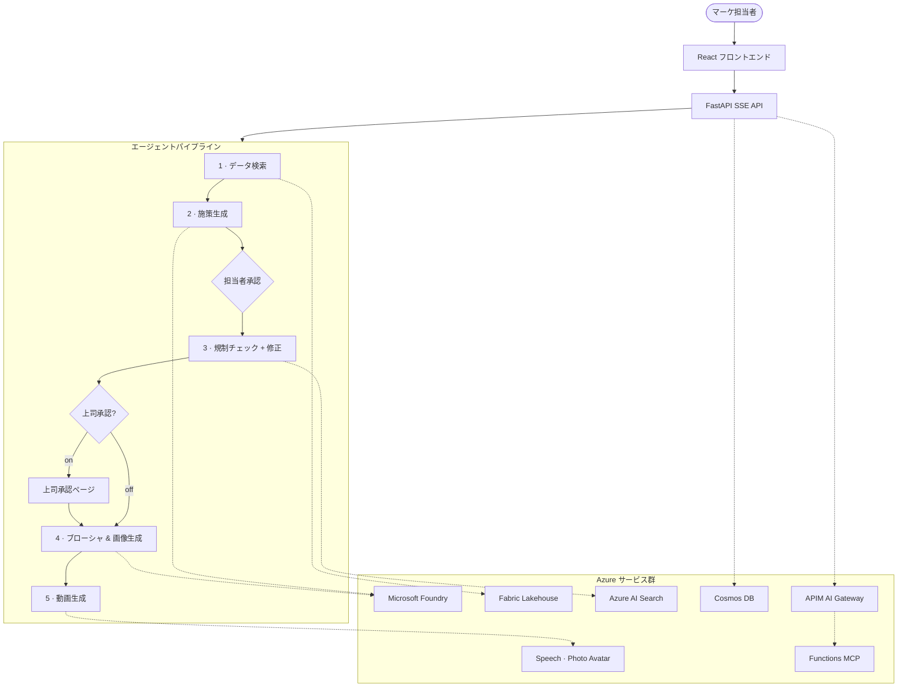

# Travel Marketing AI

[English README](README.md)

自然言語の指示ひとつで、旅行マーケティングの企画書・規制チェック済みコピー・顧客向けブローシャ・画像・販促動画を一気通貫で生成する AI マルチエージェントパイプラインです。

> **Microsoft Foundry** + **Agent Framework 1.0** + **FastAPI** + **React 19** で構築。

## アーキテクチャ



詳しい Azure リソース構成は [docs/azure-architecture.md](docs/azure-architecture.md) を参照してください。

## 主な機能

| カテゴリ | 内容 |
| --- | --- |
| **マルチエージェント** | 7 エージェントを 5 ステップに集約、承認ゲート + 任意の上司承認 |
| **AI 画像生成** | GPT Image 1.5 / MAI-Image-2（UI から選択可） |
| **動画生成** | Photo Avatar + SSML ナレーション、MP4/H.264 出力 |
| **品質評価** | Built-in 指標 + 業務カスタム指標、版比較 UI |
| **評価起点の改善** | APIM 経由の Azure Functions MCP で改善ブリーフを生成 |
| **リアルタイム配信** | SSE によるエージェント単位の進捗表示 |
| **会話履歴** | Cosmos DB 保存、再推論なしで即時復元 |
| **音声入力** | Voice Live API (MSAL.js) + Web Speech API フォールバック |
| **多言語 UI** | 日本語・英語・中国語、ダーク/ライトモード (WCAG AA) |
| **エンタープライズ連携** | Logic Apps 承認後アクション、Teams/メール通知(任意) |
| **IaC** | Bicep + azd でワンコマンド Azure デプロイ |
| **CI/CD** | GitHub Actions — Ruff, pytest, tsc, Trivy, Gitleaks |

## クイックスタート

### 前提条件

- Python 3.14+ / Node.js 22+ / [uv](https://docs.astral.sh/uv/)
- Azure デプロイ時: Azure CLI + [azd](https://learn.microsoft.com/azure/developer/azure-developer-cli/install-azd)

### インストール & 起動

```bash
uv sync                                  # Python 依存
cd frontend && npm ci && cd ..            # Node 依存
cp .env.example .env                      # Azure 接続情報を設定

uv run uvicorn src.main:app --reload      # バックエンド → http://localhost:8000
cd frontend && npm run dev                # フロントエンド → http://localhost:5173
```

> `AZURE_AI_PROJECT_ENDPOINT` 未設定でも**デモモード**で動作します。

### テスト & リント

```bash
uv run pytest                             # バックエンドテスト
uv run ruff check .                       # Python リント
cd frontend && npm run lint               # フロントエンドリント
cd frontend && npx tsc --noEmit           # TypeScript 型チェック
```

### Azure デプロイ

```bash
azd auth login
azd up                                    # プロビジョニング + ビルド + デプロイ
```

`scripts/postprovision.py` が APIM AI Gateway、MCP Function App、Voice Agent、Entra SPA 登録を自動構成します。残りの手動設定は [docs/azure-setup.md](docs/azure-setup.md) を参照してください。

## 環境変数

| 変数名 | 必須 | 用途 |
| --- | --- | --- |
| `AZURE_AI_PROJECT_ENDPOINT` | 本番 | Microsoft Foundry project endpoint |
| `MODEL_NAME` | 任意 | テキスト deployment 名（既定: `gpt-5-4-mini`） |
| `EVAL_MODEL_DEPLOYMENT` | 推奨 | `/api/evaluate` 用の専用 deployment |
| `COSMOS_DB_ENDPOINT` | 任意 | 会話履歴保存（未設定時はインメモリ） |
| `FABRIC_DATA_AGENT_URL` | 推奨 | Fabric Data Agent Published URL |
| `SPEECH_SERVICE_ENDPOINT` | 任意 | Photo Avatar 動画生成 |
| `IMPROVEMENT_MCP_ENDPOINT` | 任意 | 評価改善用 APIM MCP ルート |
| `IMAGE_PROJECT_ENDPOINT_MAI` | 任意 | MAI-Image-2 用の別 Foundry アカウント |

全項目は [.env.example](.env.example) を参照してください。

## ディレクトリ構成

```text
src/                 FastAPI バックエンド、エージェント定義、ミドルウェア
  agents/            7 エージェント（データ検索 → 品質レビュー）
  api/               REST + SSE エンドポイント
frontend/            React 19 · Vite · Tailwind CSS · i18n
infra/               Bicep IaC モジュール
data/                デモ CSV データとリプレイペイロード
regulations/         ナレッジベース投入用の規制文書
tests/               バックエンド pytest テスト
scripts/             ポストプロビジョン & デプロイ自動化
docs/                アーキテクチャ、API リファレンス、デプロイガイド
```

## ドキュメント

| ドキュメント | 説明 |
| --- | --- |
| [docs/azure-architecture.md](docs/azure-architecture.md) | Azure リソース構成とランタイムフロー |
| [docs/api-reference.md](docs/api-reference.md) | REST API と SSE イベント仕様 |
| [docs/deployment-guide.md](docs/deployment-guide.md) | ローカル、Docker、CI/CD、Azure デプロイ |
| [docs/azure-setup.md](docs/azure-setup.md) | ポストプロビジョン設定とトラブルシューティング |
| [AGENTS.md](AGENTS.md) | エージェント詳細と技術スタック |

## 技術スタック

| 層 | 技術 |
| --- | --- |
| フロントエンド | React 19 · TypeScript · Vite · Tailwind CSS |
| バックエンド | Python 3.14 · FastAPI · uvicorn |
| AI モデル | gpt-5.4-mini · GPT Image 1.5 · MAI-Image-2 |
| エージェント | Microsoft Agent Framework 1.0.0 (GA) |
| データ | Fabric Lakehouse · Delta Parquet + SQL |
| ナレッジ | Foundry IQ · Azure AI Search |
| 動画 | Speech / Photo Avatar |
| インフラ | Container Apps · APIM · Cosmos DB · Key Vault · VNet |
| CI/CD | GitHub Actions · azd · Bicep |

## ライセンス

このプロジェクトはデモンストレーション目的です。
