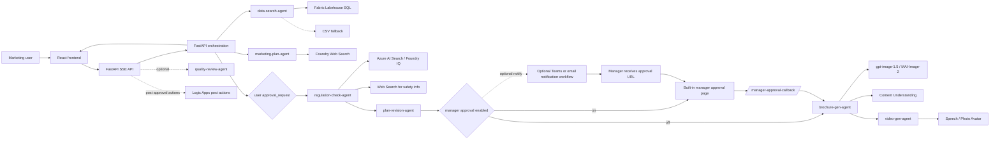

# Travel Marketing AI Multi-Agent Pipeline

[日本語版 README](README.ja.md)

Generate travel marketing plans, compliance-checked copy, brochures, images, and optional review output from one natural-language request.

## What Works Today

- React 19 frontend with SSE chat, artifact preview, conversation history restore (from Cosmos DB), replay, multilingual UI (ja/en/zh), voice input (Voice Live with MSAL.js + Web Speech API fallback), model selector (4 models), dark mode with WCAG AA contrast, a dedicated Evaluation tab with side-by-side version comparison, a global artifact version selector that can inspect committed versions while a new round or a second manager approval is pending, and a manager approval portal that compares the current revision against previous committed versions
- FastAPI backend with rate limiting, liveness/readiness probes, static asset serving from the built frontend, and a dedicated `/api/evaluate` endpoint
- Seven agents in the pipeline (data search, marketing plan, regulation check, plan revision, brochure generation, video generation, and quality review) with 5 user-facing steps: data → plan → approval → regulation + revision → brochure + video, plus an optional manager approval gate between revision and brochure generation via a built-in approval portal
- APIM-fronted Azure Functions MCP integration for evaluation-driven refinement. When `IMPROVEMENT_MCP_ENDPOINT` is configured, the backend calls `generate_improvement_brief` through APIM first and falls back to the legacy prompt-only refinement path if the MCP route is unavailable
- `scripts/postprovision.py` now auto-creates the Flex Consumption Function App for that MCP tool, deploys `mcp_server/`, and syncs the APIM `improvement-mcp` route; `.github/workflows/deploy.yml` reuses the same flow via `scripts/deploy_improvement_mcp.py`
- Fabric data access via Fabric Data Agent Published URL (`FABRIC_DATA_AGENT_URL`) when available, then Fabric Lakehouse SQL via pyodbc, then CSV fallback
- Foundry Evaluation integration with built-in metrics (relevance, coherence, fluency), custom business metrics (travel-law compliance, conversion potential, appeal, differentiation, KPI validity, brand tone), optional Foundry portal logging, and evaluation-driven refinement with frontend-side round comparison
- Optional quality-review agent that emits an extra text result after the main flow when Azure is configured
- Photo Avatar video generation (HD voice narration with SSML pacing, intro gesture, `casual-sitting` avatar, MP4/H.264 with soft-embedded subtitles)
- Voice Live API with MSAL.js authentication (Entra App Registration) and Web Speech API fallback
- Code Interpreter auto-detection with graceful fallback for data analysis
- Azure integrations for Microsoft Foundry, Azure AI Search, Cosmos DB, post-approval Logic Apps callback, built-in manager approval portal, optional external Teams or email notification workflow, Content Understanding, Speech / Photo Avatar, and Fabric Lakehouse
- `azd` + Bicep provisioning for Container Apps, ACR, APIM AI Gateway, Cosmos DB, Key Vault, VNet, Log Analytics, and Application Insights

## Current Implementation Notes

- The Azure-backed runtime calls the Microsoft Foundry project endpoint directly with `DefaultAzureCredential`, relying on deployment-level model guardrails plus lightweight local injection checks for obvious prompt override attempts.
- APIM AI Gateway is provisioned and configured via `scripts/postprovision.py`, which creates a Foundry AI Gateway connection (`travel-ai-gateway`) and applies `llm-token-limit` plus `llm-emit-token-metric` policies to the generated `foundry-*` APIs.
- APIM-side content safety is not currently configured. Prompt Shields, document or indirect attack protection, tool-response intervention, and Spotlighting require explicit Azure or Foundry-side assignment and are not assumed by the current runtime.
- `POST /api/chat` in Azure mode pauses for user approval after Agent2 (marketing-plan-agent).
- After user approval, the runtime executes Agent3a → Agent3b and, when `manager_approval_enabled=true`, pauses for manager approval by issuing a built-in manager approval URL before resuming Agent4 → Agent5.
- If `MANAGER_APPROVAL_TRIGGER_URL` is configured, an external workflow is invoked only to notify the manager with that approval URL. If it is missing or delivery fails, the requester can manually share the generated link.
- The Bicep deployment provisions the post-approval Logic Apps callback only. Manager approval itself is handled by the built-in portal, while the optional external notification workflow is documented in [docs/manager-approval-workflow.md](docs/manager-approval-workflow.md).
- The pipeline uses 5 user-facing steps powered by 7 internal agents (Agent3a+3b share step 4, Agent4+5 share step 5).
- Agent1 first tries the Fabric Data Agent Published URL (`FABRIC_DATA_AGENT_URL`) with AAD auth and the Assistants-compatible endpoint. If unavailable, it falls back to Fabric Lakehouse SQL via pyodbc (`SQL_COPT_SS_ACCESS_TOKEN`), then CSV data.
- Agent4 generates customer-facing brochures that exclude KPI, sales targets, and internal analysis.
- Agent5 (video-gen-agent) generates Photo Avatar promotional videos using SSML-driven narration, `ja-JP-Nanami:DragonHDLatestNeural`, an intro gesture, and MP4/H.264 output.
- Agent6 (quality-review-agent) uses `GitHubCopilotAgent` with `PermissionHandler.approve_all` for automated permission handling.
- Code Interpreter is auto-detected at runtime with a graceful fallback (`ENABLE_CODE_INTERPRETER=false` to disable).
- The current release uses Azure Functions MCP only for the improvement-brief step in evaluation-driven refinement. Other business tools remain in-process `@tool` implementations inside the FastAPI-hosted agent flow.
- The frontend surfaces this remote MCP call inside the refinement round as a tool badge with `source=mcp`, so UI tests can distinguish it from local tool execution.
- The expected APIM public MCP route is `https://<apim>.azure-api.net/improvement-mcp/runtime/webhooks/mcp`. If APIM keeps `subscriptionRequired=false`, leave `IMPROVEMENT_MCP_API_KEY` empty.
- A model selector in the frontend lets users choose between `gpt-5-4-mini` (default), `gpt-5.4`, `gpt-4-1-mini`, and `gpt-4.1`.
- `POST /api/evaluate` combines `azure-ai-evaluation` built-in evaluators (Relevance / Coherence / Fluency) with code-based and prompt-based custom evaluators, and can return a Foundry portal URL for the logged evaluation run.
- Evaluation-driven refinement sends generated feedback back into `POST /api/chat`, regenerates the marketing plan, returns a fresh `approval_request`, and on approval reruns regulation, brochure, image, and video generation.
- The frontend snapshots every completed run and `VersionSelector` restores plan, brochure, images, and video together.
- After the final approval step, user-visible completion is emitted as soon as brochure and image generation finish. Video polling, quality review, and post-approval Logic Apps actions may continue as background updates and are merged into the same conversation history.
- While a new version is generating or waiting for a second manager approval, the right pane keeps the latest committed version visible by default. Users can switch to the live pending version from the generating chip and switch back without losing earlier committed results.
- The evaluation panel compares the current artifact version against a selected saved version without changing the main artifact preview. It now shows both versions as summary cards at the top of the comparison area.
- The built-in manager approval portal calls `GET /api/chat/{thread_id}/manager-approval-request`, receives `current_version` plus `previous_versions`, and renders the current revision side-by-side with any previously committed version. The backend also keeps this comparison payload in the pending approval context so it survives timing gaps between persistence and portal load.
- If the raw evaluation payload contains `task_adherence`, the frontend intentionally excludes it from visible score cards, comparison deltas, overall round summaries, and generated refinement feedback because it is currently too noisy to guide iteration.
- Voice Live API is authenticated via MSAL.js with Entra App Registration. The `VoiceInput` component supports dual-mode: Voice Live for real-time voice, with automatic fallback to Web Speech API.
- Conversation history is restored from Cosmos DB via `restoreConversation()` without re-running inference.
- Runtime knowledge-base queries use Managed Identity. `scripts/setup_knowledge_base.py` still supports direct Azure AI Search API-key bootstrap as an optional setup path.

See [docs/azure-architecture.md](docs/azure-architecture.md) for the current Azure architecture and diagram set.

## Verified Azure Snapshot

- Verified in a deployed dev environment as of `2026-04-05`: `/api/health=ok` and `/api/ready=ready`.
- The runtime text deployment, evaluation deployment, and `gpt-image-1.5` image deployment are active in Azure.
- The evaluation-refinement path has been validated through an APIM-fronted `improvement-mcp` route backed by Azure Functions MCP.
- Fabric-backed search, AI Gateway post-provisioning, and the built-in post-approval Logic Apps callback have all been exercised in Azure.

## Architecture At A Glance



See [docs/architecture.drawio](docs/architecture.drawio) for the full architecture diagram.

## Quick Start

### Prerequisites

- Python 3.14+
- Node.js 22+
- [uv](https://docs.astral.sh/uv/)
- Azure CLI and Azure Developer CLI (`azd`) if you want Azure deployment

### Local Setup

```bash
uv sync
cd frontend && npm ci && cd ..
cp .env.example .env
```

Update `.env` with the Azure endpoints you want to use. If `.env` or process env leaves Azure values empty, the backend also falls back to `azd env get-values`, so after `azd up` you can usually run locally without manually copying `IMPROVEMENT_MCP_ENDPOINT` or `AZURE_AI_PROJECT_ENDPOINT`. If you use multiple azd environments, run `azd env select <name>` before starting FastAPI. If `AZURE_AI_PROJECT_ENDPOINT` is still not resolved, the app falls back to mock/demo behavior.

### Local Run

```bash
uv run uvicorn src.main:app --reload --port 8000
cd frontend && npm run dev
```

Frontend: `http://localhost:5173`

Backend: `http://localhost:8000`

### Validation

```bash
uv run pytest
uv run ruff check .
cd frontend && npm run lint
cd frontend && npx tsc --noEmit
cd frontend && npm run build
```

### Azure Deployment

```bash
azd auth login
azd up
```

After provisioning, `scripts/postprovision.py` automatically configures the AI Gateway connection and APIM policies. See [docs/azure-setup.md](docs/azure-setup.md) for remaining manual steps such as Azure AI Search setup and optional Speech / Logic Apps configuration.

If you want Teams or email notifications for manager approval, also follow [docs/manager-approval-workflow.md](docs/manager-approval-workflow.md) and set `MANAGER_APPROVAL_TRIGGER_URL`.

## Key Environment Variables

| Variable | Required | Purpose |
| --- | --- | --- |
| `AZURE_AI_PROJECT_ENDPOINT` | Production | Microsoft Foundry project endpoint for runtime agent calls |
| `MODEL_NAME` | Optional | Text deployment name, default `gpt-5-4-mini`. Frontend model selector also offers `gpt-5.4`, `gpt-4-1-mini`, `gpt-4.1` |
| `EVAL_MODEL_DEPLOYMENT` | Recommended | Separate deployment name for `/api/evaluate`. Falls back to `MODEL_NAME` if unset |
| `IMPROVEMENT_MCP_ENDPOINT` | Optional | APIM public MCP route for `generate_improvement_brief`. If unset or unavailable, refinement falls back to the legacy in-process prompt path |
| `IMPROVEMENT_MCP_API_KEY` | Optional | APIM subscription key or other gateway key, only if the MCP API requires it |
| `IMPROVEMENT_MCP_API_KEY_HEADER` | Optional | Header name for the MCP gateway key. Defaults to `Ocp-Apim-Subscription-Key` |
| `ENVIRONMENT` | Optional | `development`, `staging`, or `production` |
| `SERVE_STATIC` | Optional | Serve the built frontend from FastAPI (`true` in containerized deployments) |
| `API_KEY` | Optional | Enables `x-api-key` protection for `/api/*` except `health` / `ready` |
| `COSMOS_DB_ENDPOINT` | Optional | Conversation storage; otherwise in-memory fallback |
| `FABRIC_DATA_AGENT_URL` | Recommended | Fabric Data Agent Published URL ending with `/aiassistant/openai`; Agent1 tries this first for natural-language data analysis |
| `FABRIC_SQL_ENDPOINT` | Optional fallback | Fabric Lakehouse SQL endpoint used when the Data Agent is unavailable or additional structured lookup is needed |
| `CONTENT_UNDERSTANDING_ENDPOINT` | Optional | PDF analysis for brochure reference material |
| `IMAGE_PROJECT_ENDPOINT_MAI` | Optional | MAI-Image-2 resource endpoint (separate Foundry account); when set, MAI-Image-2 becomes selectable in the UI |
| `SPEECH_SERVICE_ENDPOINT` | Optional | Speech / Photo Avatar endpoint for video generation |
| `SPEECH_SERVICE_REGION` | Optional | Speech region used by promo-video generation |
| `VOICE_AGENT_NAME` | Optional | Voice Live agent name returned by `/api/voice-config` |
| `VOICE_SPA_CLIENT_ID` | Optional | Entra App Registration client ID for Voice Live MSAL.js auth |
| `AZURE_TENANT_ID` | Optional | Entra tenant ID for Voice Live authentication |
| `LOGIC_APP_CALLBACK_URL` | Optional | HTTP trigger used for post-approval actions |
| `MANAGER_APPROVAL_TRIGGER_URL` | Optional | HTTP trigger for the optional manager approval notification workflow |
| `APPLICATIONINSIGHTS_CONNECTION_STRING` | Optional | Application Insights telemetry |

See [.env.example](.env.example) for the complete local example file.

For Azure provisioning and GitHub Actions deploys, MAI-Image-2 also needs `MAI_RESOURCE_NAME` so the Container App managed identity can receive RBAC on the separate Azure AI / Foundry account.

## Remote MCP Tool

- The current release already uses one remote MCP tool: `generate_improvement_brief`, hosted on Azure Functions and exposed through APIM.
- The rest of the pipeline still uses in-process `@tool` implementations, which keeps the main agent flow simple while allowing the evaluation-refinement step to be governed separately.
- For additional remote tools, follow the same pattern: Azure Functions MCP extension on Flex Consumption, APIM exposure, and graceful fallback in FastAPI when the MCP route is unavailable.

## Repository Layout

```text
src/                 FastAPI app, agent definitions, workflow orchestration, middleware
frontend/            React UI, SSE hooks, artifact views, conversation history
infra/               Bicep templates for Azure resources
data/                Demo data and replay payloads
regulations/         Regulation source documents for the knowledge base
tests/               Backend tests
docs/                API, deployment, Azure setup, architecture documentation
```

## Documentation

- [docs/azure-architecture.md](docs/azure-architecture.md): current Azure runtime and resource diagrams
- [docs/api-reference.md](docs/api-reference.md): REST and SSE contract for the current implementation
- [docs/deployment-guide.md](docs/deployment-guide.md): local, Docker, CI/CD, and Azure deployment behavior
- [docs/azure-setup.md](docs/azure-setup.md): Azure provisioning, post-provision steps, and auth model
- [mcp_server/README.md](mcp_server/README.md): Azure Functions MCP tool shape, APIM registration, and compatibility notes
- [docs/manager-approval-workflow.md](docs/manager-approval-workflow.md): request/callback contract for the optional external manager approval notification workflow
- [docs/requirements_v4.0.md](docs/requirements_v4.0.md): requirements document (v4.0, aligned with current implementation)
