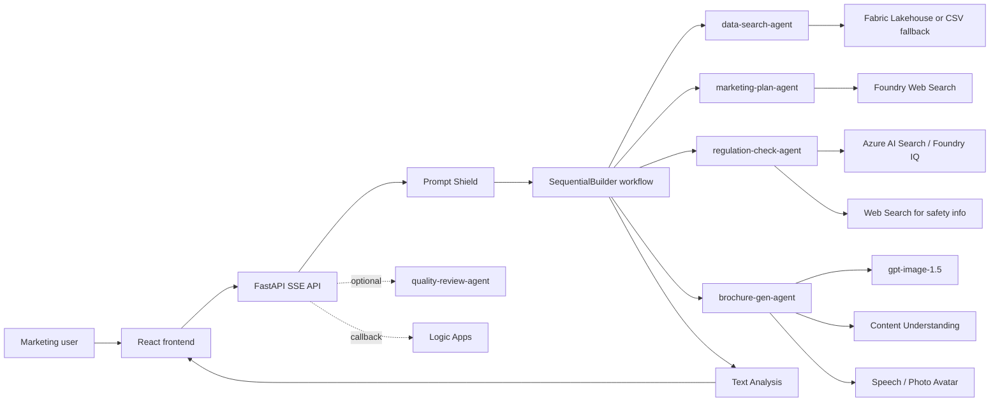

# Travel Marketing AI Multi-Agent Pipeline

[日本語版 README](README.ja.md)

Generate travel marketing plans, compliance-checked copy, brochures, images, and optional review output from one natural-language request.

## What Works Today

- React 19 frontend with SSE chat, artifact preview, conversation history, replay, multilingual UI, and voice input controls
- FastAPI backend with rate limiting, liveness/readiness probes, and static asset serving from the built frontend
- Four primary agents in a Python `SequentialBuilder` workflow: data search, marketing plan, regulation check, and brochure generation
- Optional quality-review agent that emits an extra text result after the main flow when Azure is configured
- Azure integrations for Microsoft Foundry, Content Safety, Azure AI Search, Cosmos DB, Logic Apps callback, Content Understanding, and Speech / Photo Avatar
- `azd` + Bicep provisioning for Container Apps, ACR, APIM AI Gateway, Azure Functions, Cosmos DB, Key Vault, VNet, Log Analytics, and Application Insights

## Current Implementation Notes

- The Azure-backed runtime currently calls the Microsoft Foundry project endpoint directly with `DefaultAzureCredential`.
- APIM AI Gateway is provisioned in Azure, but application runtime traffic is not yet routed through `APIM_GATEWAY_URL`.
- `POST /api/chat` in Azure mode runs the full 4-agent workflow end-to-end without pausing for approval.
- `approval_request` SSE events are currently produced by mock/demo flows and approval-continuation paths, not by the default Azure-backed workflow path.
- Runtime knowledge-base queries use Managed Identity. `scripts/setup_knowledge_base.py` still supports direct Azure AI Search API-key bootstrap as an optional setup path.

See [docs/azure-architecture.md](docs/azure-architecture.md) for the current Azure architecture and diagram set.

## Architecture At A Glance



## Quick Start

### Prerequisites

- Python 3.14+
- Node.js 22+
- [uv](https://docs.astral.sh/uv/)
- Azure CLI and Azure Developer CLI (`azd`) if you want Azure deployment

### Local Setup

```bash
uv sync
cd frontend && npm ci && cd ..
cp .env.example .env
```

Update `.env` with the Azure endpoints you want to use. If `AZURE_AI_PROJECT_ENDPOINT` is not set, the app falls back to mock/demo behavior.

### Local Run

```bash
uv run uvicorn src.main:app --reload --port 8000
cd frontend && npm run dev
```

Frontend: `http://localhost:5173`

Backend: `http://localhost:8000`

### Validation

```bash
uv run pytest
uv run ruff check .
cd frontend && npm run lint
cd frontend && npx tsc --noEmit
cd frontend && npm run build
```

### Azure Deployment

```bash
azd auth login
azd up
```

After provisioning, complete the post-provision Azure tasks in [docs/azure-setup.md](docs/azure-setup.md). Those steps cover image-model deployment, Azure AI Search setup, and optional Speech / Logic Apps configuration.

## Key Environment Variables

| Variable | Required | Purpose |
|---|---|---|
| `AZURE_AI_PROJECT_ENDPOINT` | Production | Microsoft Foundry project endpoint for runtime agent calls |
| `CONTENT_SAFETY_ENDPOINT` | Production | Content Safety / Text Analysis endpoint |
| `MODEL_NAME` | Optional | Text deployment name, default `gpt-5-4-mini` |
| `ENVIRONMENT` | Optional | `development`, `staging`, or `production` |
| `COSMOS_DB_ENDPOINT` | Optional | Conversation storage; otherwise in-memory fallback |
| `FABRIC_SQL_ENDPOINT` | Optional | Fabric Lakehouse SQL endpoint |
| `CONTENT_UNDERSTANDING_ENDPOINT` | Optional | PDF analysis for brochure reference material |
| `SPEECH_SERVICE_ENDPOINT` | Optional | Speech / Photo Avatar endpoint |
| `SPEECH_SERVICE_REGION` | Optional | Speech region used by promo-video generation |
| `LOGIC_APP_CALLBACK_URL` | Optional | HTTP trigger used after approval continuation |
| `APPLICATIONINSIGHTS_CONNECTION_STRING` | Optional | Application Insights telemetry |

See [.env.example](.env.example) for the complete local example file.

## Repository Layout

```text
src/                 FastAPI app, agent definitions, workflow orchestration, middleware
frontend/            React UI, SSE hooks, artifact views, conversation history
functions/           Azure Functions-based MCP-style helpers
infra/               Bicep templates for Azure resources
data/                Demo data and replay payloads
regulations/         Regulation source documents for the knowledge base
tests/               Backend tests
docs/                API, deployment, Azure setup, architecture documentation
```

## Documentation

- [docs/azure-architecture.md](docs/azure-architecture.md): current Azure runtime and resource diagrams
- [docs/api-reference.md](docs/api-reference.md): REST and SSE contract for the current implementation
- [docs/deployment-guide.md](docs/deployment-guide.md): local, Docker, CI/CD, and Azure deployment behavior
- [docs/azure-setup.md](docs/azure-setup.md): Azure provisioning, post-provision steps, and auth model
- [docs/requirements_v3.7.md](docs/requirements_v3.7.md): target requirements document
