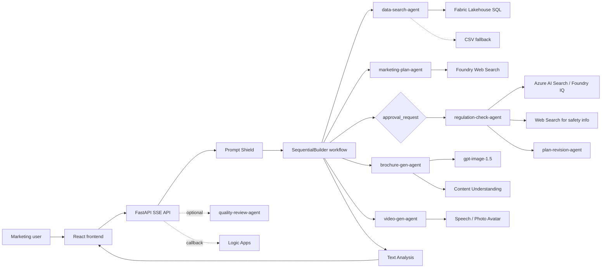

# Travel Marketing AI Multi-Agent Pipeline

[日本語版 README](README.ja.md)

Generate travel marketing plans, compliance-checked copy, brochures, images, and optional review output from one natural-language request.

## What Works Today

- React 19 frontend with SSE chat, artifact preview, conversation history restore (from Cosmos DB), replay, multilingual UI (ja/en/zh), voice input (Voice Live with MSAL.js + Web Speech API fallback), model selector (4 models), dark mode with WCAG AA contrast, a plan-tab evaluation panel, and a global artifact version selector for v1/v2 comparison
- FastAPI backend with rate limiting, liveness/readiness probes, static asset serving from the built frontend, and a dedicated `/api/evaluate` endpoint
- Seven agents in the pipeline (data search, marketing plan, regulation check, plan revision, brochure generation, video generation, and quality review) with 5 user-facing steps: data → plan → approval → regulation + revision → brochure + video
- Fabric data access via Fabric Data Agent Published URL (`FABRIC_DATA_AGENT_URL`) when available, then Fabric Lakehouse SQL via pyodbc, then CSV fallback
- Foundry Evaluation integration with built-in metrics (relevance, coherence, fluency), custom business metrics (travel-law compliance, conversion potential, appeal, differentiation, KPI validity, brand tone), optional Foundry portal logging, and evaluation-driven refinement
- Optional quality-review agent that emits an extra text result after the main flow when Azure is configured
- Photo Avatar video generation (`casual-sitting` style, MP4/H.264 with soft-embedded subtitles)
- Voice Live API with MSAL.js authentication (Entra App Registration) and Web Speech API fallback
- Code Interpreter auto-detection with graceful fallback for data analysis
- Azure integrations for Microsoft Foundry, Content Safety, Azure AI Search, Cosmos DB, Logic Apps callback, Content Understanding, Speech / Photo Avatar, and Fabric Lakehouse
- `azd` + Bicep provisioning for Container Apps, ACR, APIM AI Gateway, Cosmos DB, Key Vault, VNet, Log Analytics, and Application Insights

## Current Implementation Notes

- The Azure-backed runtime calls the Microsoft Foundry project endpoint directly with `DefaultAzureCredential`.
- APIM AI Gateway is provisioned and configured via `scripts/postprovision.py`, which creates a Foundry AI Gateway connection (`travel-ai-gateway`) and applies token-limit policies to the auto-generated foundry APIs.
- `POST /api/chat` in Azure mode pauses for approval after Agent2 (marketing-plan-agent) and resumes Agent3a → Agent3b → Agent4 → Agent5 upon user approval.
- The pipeline uses 5 user-facing steps powered by 7 internal agents (Agent3a+3b share step 4, Agent4+5 share step 5).
- Agent1 first tries the Fabric Data Agent Published URL (`FABRIC_DATA_AGENT_URL`) with AAD auth and the Assistants-compatible endpoint. If unavailable, it falls back to Fabric Lakehouse SQL via pyodbc (`SQL_COPT_SS_ACCESS_TOKEN`), then CSV data.
- Agent4 generates customer-facing brochures that exclude KPI, sales targets, and internal analysis.
- Agent5 (video-gen-agent) generates Photo Avatar promotional videos using the `casual-sitting` style with `ja-JP-NanamiNeural` voice and MP4/H.264 output.
- Agent6 (quality-review-agent) uses `GitHubCopilotAgent` with `PermissionHandler.approve_all` for automated permission handling.
- Code Interpreter is auto-detected at runtime with a graceful fallback (`ENABLE_CODE_INTERPRETER=false` to disable).
- A model selector in the frontend lets users choose between `gpt-5-4-mini` (default), `gpt-5.4`, `gpt-4-1-mini`, and `gpt-4.1`.
- `POST /api/evaluate` combines `azure-ai-evaluation` built-in evaluators (Relevance / Coherence / Fluency) with code-based and prompt-based custom evaluators, and can return a Foundry portal URL for the logged evaluation run.
- Evaluation-driven refinement sends generated feedback back into `POST /api/chat`, regenerates the marketing plan, returns a fresh `approval_request`, and on approval reruns regulation, brochure, image, and video generation.
- The frontend snapshots every completed run and `VersionSelector` restores plan, brochure, images, and video together.
- Voice Live API is authenticated via MSAL.js with Entra App Registration. The `VoiceInput` component supports dual-mode: Voice Live for real-time voice, with automatic fallback to Web Speech API.
- Conversation history is restored from Cosmos DB via `restoreConversation()` without re-running inference.
- Runtime knowledge-base queries use Managed Identity. `scripts/setup_knowledge_base.py` still supports direct Azure AI Search API-key bootstrap as an optional setup path.

See [docs/azure-architecture.md](docs/azure-architecture.md) for the current Azure architecture and diagram set.

## Architecture At A Glance



See [docs/architecture.drawio](docs/architecture.drawio) for the full architecture diagram.

## Quick Start

### Prerequisites

- Python 3.14+
- Node.js 22+
- [uv](https://docs.astral.sh/uv/)
- Azure CLI and Azure Developer CLI (`azd`) if you want Azure deployment

### Local Setup

```bash
uv sync
cd frontend && npm ci && cd ..
cp .env.example .env
```

Update `.env` with the Azure endpoints you want to use. If `AZURE_AI_PROJECT_ENDPOINT` is not set, the app falls back to mock/demo behavior.

### Local Run

```bash
uv run uvicorn src.main:app --reload --port 8000
cd frontend && npm run dev
```

Frontend: `http://localhost:5173`

Backend: `http://localhost:8000`

### Validation

```bash
uv run pytest
uv run ruff check .
cd frontend && npm run lint
cd frontend && npx tsc --noEmit
cd frontend && npm run build
```

### Azure Deployment

```bash
azd auth login
azd up
```

After provisioning, `scripts/postprovision.py` automatically configures the AI Gateway connection and APIM policies. See [docs/azure-setup.md](docs/azure-setup.md) for remaining manual steps such as Azure AI Search setup and optional Speech / Logic Apps configuration.

## Key Environment Variables

| Variable | Required | Purpose |
|---|---|---|
| `AZURE_AI_PROJECT_ENDPOINT` | Production | Microsoft Foundry project endpoint for runtime agent calls |
| `CONTENT_SAFETY_ENDPOINT` | Production | Content Safety / Text Analysis endpoint |
| `MODEL_NAME` | Optional | Text deployment name, default `gpt-5-4-mini`. Frontend model selector also offers `gpt-5.4`, `gpt-4-1-mini`, `gpt-4.1` |
| `EVAL_MODEL_DEPLOYMENT` | Recommended | Separate deployment name for `/api/evaluate`. Falls back to `MODEL_NAME` if unset |
| `ENVIRONMENT` | Optional | `development`, `staging`, or `production` |
| `SERVE_STATIC` | Optional | Serve the built frontend from FastAPI (`true` in containerized deployments) |
| `API_KEY` | Optional | Enables `x-api-key` protection for `/api/*` except `health` / `ready` |
| `COSMOS_DB_ENDPOINT` | Optional | Conversation storage; otherwise in-memory fallback |
| `FABRIC_DATA_AGENT_URL` | Recommended | Fabric Data Agent Published URL ending with `/aiassistant/openai`; Agent1 tries this first for natural-language data analysis |
| `FABRIC_SQL_ENDPOINT` | Optional fallback | Fabric Lakehouse SQL endpoint used when the Data Agent is unavailable or additional structured lookup is needed |
| `CONTENT_UNDERSTANDING_ENDPOINT` | Optional | PDF analysis for brochure reference material |
| `SPEECH_SERVICE_ENDPOINT` | Optional | Speech / Photo Avatar endpoint for video generation |
| `SPEECH_SERVICE_REGION` | Optional | Speech region used by promo-video generation |
| `VOICE_AGENT_NAME` | Optional | Voice Live agent name returned by `/api/voice-config` |
| `VOICE_SPA_CLIENT_ID` | Optional | Entra App Registration client ID for Voice Live MSAL.js auth |
| `AZURE_TENANT_ID` | Optional | Entra tenant ID for Voice Live authentication |
| `LOGIC_APP_CALLBACK_URL` | Optional | HTTP trigger used after approval continuation |
| `APPLICATIONINSIGHTS_CONNECTION_STRING` | Optional | Application Insights telemetry |

See [.env.example](.env.example) for the complete local example file.

## Repository Layout

```text
src/                 FastAPI app, agent definitions, workflow orchestration, middleware
frontend/            React UI, SSE hooks, artifact views, conversation history
infra/               Bicep templates for Azure resources
data/                Demo data and replay payloads
regulations/         Regulation source documents for the knowledge base
tests/               Backend tests
docs/                API, deployment, Azure setup, architecture documentation
```

## Documentation

- [docs/azure-architecture.md](docs/azure-architecture.md): current Azure runtime and resource diagrams
- [docs/api-reference.md](docs/api-reference.md): REST and SSE contract for the current implementation
- [docs/deployment-guide.md](docs/deployment-guide.md): local, Docker, CI/CD, and Azure deployment behavior
- [docs/azure-setup.md](docs/azure-setup.md): Azure provisioning, post-provision steps, and auth model
- [docs/requirements_v4.0.md](docs/requirements_v4.0.md): requirements document (v4.0, aligned with current implementation)
