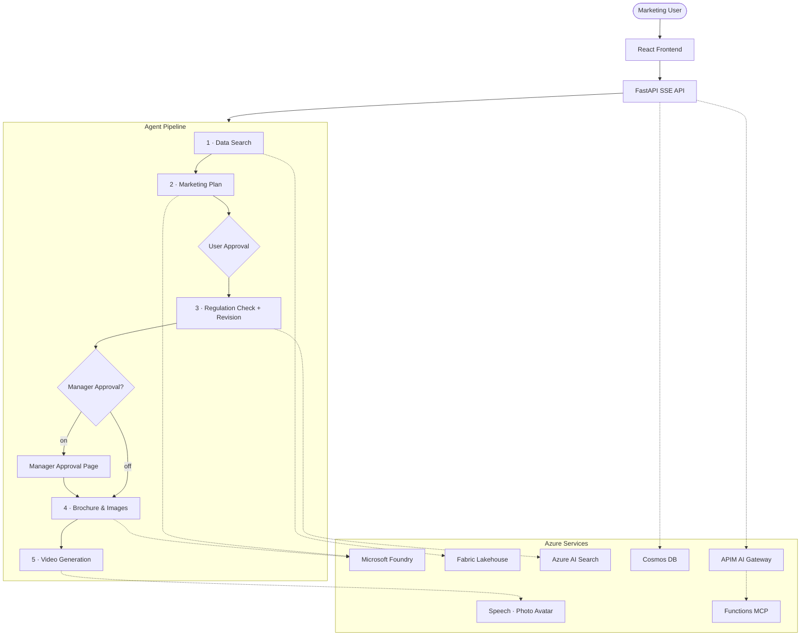

# Travel Marketing AI

[日本語版 README](README.ja.md)

An AI multi-agent pipeline that turns a single natural-language brief into a complete travel marketing package — plan, compliance-checked copy, customer-facing brochure, hero/banner images, and promotional video.

> Built with **Microsoft Foundry**, **Agent Framework 1.0**, **FastAPI**, and **React 19**.

## Architecture



See [docs/azure-architecture.md](docs/azure-architecture.md) for detailed Azure resource diagrams.

## Key Features

| Category | Details |
| --- | --- |
| **Multi-Agent Pipeline** | 7 agents in 5 user-facing steps with human-in-the-loop approval and optional manager gate |
| **AI Image Generation** | GPT Image 1.5 / GPT Image 2 / MAI-Image-2 — hero visuals and SNS banners, selectable in UI |
| **Video Generation** | Photo Avatar with SSML narration, HD voice, MP4/H.264 |
| **Quality Evaluation** | Built-in + custom business metrics with side-by-side version comparison |
| **Evaluation-Driven Refinement** | Feed results back via APIM-fronted Azure Functions MCP |
| **Real-Time Streaming** | SSE with per-agent step tracking (15-min timeout) |
| **Conversation History** | Cosmos DB persistence, instant restore, new-conversation button |
| **Voice Input** | Voice Live API (MSAL.js) + Web Speech API fallback |
| **Multilingual UI** | Japanese / English / Chinese, dark/light mode (WCAG AA) |
| **Enterprise Integration** | Logic Apps post-approval actions, optional Teams/email notification |
| **Infrastructure as Code** | Bicep + azd for one-command Azure deployment |
| **CI/CD** | GitHub Actions — Ruff, pytest, tsc, Trivy, Gitleaks |

## Quick Start

### Prerequisites

- Python 3.14+ / Node.js 22+ / [uv](https://docs.astral.sh/uv/)
- Azure CLI + [azd](https://learn.microsoft.com/azure/developer/azure-developer-cli/install-azd) for Azure deployment

### Install & Run

```bash
uv sync                                  # Python dependencies
cd frontend && npm ci && cd ..            # Node dependencies
cp .env.example .env                      # configure Azure endpoints

uv run uvicorn src.main:app --reload      # backend  → http://localhost:8000
cd frontend && npm run dev                # frontend → http://localhost:5173
```

> Without `AZURE_AI_PROJECT_ENDPOINT` the app runs in **demo mode** with mock data.

### Test & Lint

```bash
uv run pytest                             # backend tests
uv run ruff check .                       # Python lint
cd frontend && npm run lint               # frontend lint
cd frontend && npx tsc --noEmit           # TypeScript check
```

### Deploy to Azure

```bash
azd auth login
azd up                                    # provision + build + deploy
```

`scripts/postprovision.py` auto-configures the APIM AI Gateway, MCP Function App, Voice Agent, Marketing-plan Prompt Agent sync, and Entra SPA registration. See [docs/azure-setup.md](docs/azure-setup.md) for the current tenant snapshot and the remaining follow-up items.

### Current Azure status (`workiq-dev` tenant)

| Area | Current state |
| --- | --- |
| Work IQ delegated auth | SPA redirect URIs, Microsoft Graph delegated permissions, tenant-wide admin consent, and Microsoft 365 Copilot license verification are complete |
| Work IQ runtime | The default runtime is `MARKETING_PLAN_RUNTIME=foundry_preprovisioned` + `WORKIQ_RUNTIME=foundry_tool`. Agent2 runs the pre-provisioned Foundry Prompt Agent through `agent_reference`, the frontend acquires `https://ai.azure.com/user_impersonation`, and the backend passes that user token into Foundry Responses so the attached Work IQ MCP connection runs per-user. `graph_prefetch` remains the explicit rollback path, where a short Microsoft Graph Copilot Chat API brief is prefetched (`chatOverStream` preferred, `/chat` fallback, `WORK_IQ_TIMEOUT_SECONDS=120` by default). Frontend preflight surfaces `auth_required`, `consent_required`, and `redirecting`, and the backend persists `work_iq_session` status so restored conversations keep the same UI state. Accounts outside the tenant/guest list are rejected during sign-in |
| Search / Foundry IQ | `regulations-index`, `regulations-ks`, and `regulations-kb` are live on Azure AI Search in **East US** and wired to the app via `SEARCH_ENDPOINT` + `SEARCH_API_KEY` |
| Model deployments | The text deployments are `gpt-5-4-mini`, `gpt-4-1-mini`, `gpt-4.1`, and `gpt-5.4`. The app default image route is now `gpt-image-2`; deploy it under the default name or set `GPT_IMAGE_2_DEPLOYMENT_NAME` when the deployment name differs. `gpt-image-1.5` remains supported |
| MAI image route | `IMAGE_PROJECT_ENDPOINT_MAI` points to a separate East US AI Services account. The `MAI-Image-2` deployment name is currently an alias for **MAI-Image-2e** because this subscription doesn't have `MAI-Image-2` quota |
| Fabric | Fabric capacity `fcdemojapaneast001`, workspace `ws-MG-pod2`, lakehouse `Travel_Lakehouse`, and the `sales_results` / `customer_reviews` tables are restored. The live app now uses both `FABRIC_DATA_AGENT_URL` and `FABRIC_SQL_ENDPOINT` |
| Logic Apps / Teams | `logic-manager-approval-wmbvhdhcsuyb2` and `logic-wmbvhdhcsuyb2` are live. Manager approval notification and post-approval Teams channel delivery were revalidated, and `deploy.yml` now resyncs the full signed manager trigger URL into the Container App secret |
| Remaining manual work | Only the SharePoint save path remains as manual follow-up; Fabric, manager approval, and Teams notification are already live |

## Environment Variables

| Variable | Required | Purpose |
| --- | --- | --- |
| `AZURE_AI_PROJECT_ENDPOINT` | Production | Microsoft Foundry project endpoint |
| `MODEL_NAME` | Optional | Text deployment name (default: `gpt-5-4-mini`) |
| `EVAL_MODEL_DEPLOYMENT` | Recommended | Separate deployment for `/api/evaluate` |
| `COSMOS_DB_ENDPOINT` | Optional | Conversation persistence (in-memory fallback) |
| `SEARCH_ENDPOINT` | Optional | Azure AI Search endpoint for Foundry IQ / direct knowledge-base lookup |
| `SEARCH_API_KEY` | Optional | Azure AI Search admin key (stored as a secret in Container Apps for the live tenant) |
| `FABRIC_DATA_AGENT_URL` | Recommended | Fabric Data Agent Published URL |
| `MARKETING_PLAN_RUNTIME` | Optional | Marketing-plan runtime selector (default: `foundry_preprovisioned`; `legacy` remains available for rollback/testing) |
| `WORKIQ_RUNTIME` | Optional | Work IQ runtime selector (default: `foundry_tool`; `graph_prefetch` remains available as the explicit rollback path) |
| `WORK_IQ_TIMEOUT_SECONDS` | Optional | Timeout for the `graph_prefetch` rollback path when fetching a short Work IQ brief from Microsoft Graph Copilot Chat API (default: `120`) |
| `PUBLIC_APP_BASE_URL` | Recommended for manager approval | Canonical public base URL used when generating manager approval and callback links |
| `ENABLE_GITHUB_COPILOT_REVIEW_AGENT` | Optional | Opt-in for the preview `GitHubCopilotAgent` quality review path. Default is `false`, which keeps the safer Foundry review fallback |
| `SPEECH_SERVICE_ENDPOINT` | Optional | Photo Avatar video generation |
| `IMPROVEMENT_MCP_ENDPOINT` | Optional | APIM MCP route for evaluation refinement |
| `IMAGE_PROJECT_ENDPOINT_MAI` | Optional | Separate MAI-capable AI Services endpoint |

Full list in [.env.example](.env.example).

## Project Structure

```text
src/                 FastAPI backend, agent definitions, middleware
  agents/            7 agents (data search → quality review)
  api/               REST + SSE endpoints
frontend/            React 19 · Vite · Tailwind CSS · i18n
infra/               Bicep IaC modules
data/                Demo CSV data and replay payloads
regulations/         Regulation documents for knowledge base
tests/               Backend pytest suite
scripts/             Post-provision and deployment automation
docs/                Architecture, API reference, deployment guides
```

## Documentation

| Document | Description |
| --- | --- |
| [docs/azure-architecture.md](docs/azure-architecture.md) | Azure resource diagram and runtime flow |
| [docs/api-reference.md](docs/api-reference.md) | REST API and SSE event specification |
| [docs/deployment-guide.md](docs/deployment-guide.md) | Local, Docker, CI/CD, and Azure deployment |
| [docs/azure-setup.md](docs/azure-setup.md) | Post-provision setup and troubleshooting |
| [AGENTS.md](AGENTS.md) | Agent details and tech stack reference |

## Implementation Status (2026-04-10)

| Metric | Value |
| --- | --- |
| Backend Python | 24 files · 6,764 lines |
| Frontend React/TS | 44 files · 6,764 lines (30 TSX + 14 TS) |
| Infrastructure (Bicep) | 16 files · 1,227 lines |
| Test Coverage | 68% (277 pytest · 83 vitest) |
| Test Code | 32 files · 6,890 lines |
| UI Components | 28 components |
| SSE Event Types | 7 (agent_progress, tool_event, text, image, approval_request, error, done) |
| Agents | 7 (data-search, marketing-plan, regulation-check, plan-revision, brochure-gen, video-gen, quality-review) |
| CI/CD Workflows | 3 (CI · Deploy · Security) |

## Tech Stack

| Layer | Technology |
| --- | --- |
| Frontend | React 19 · TypeScript · Vite 8 · Tailwind CSS 4 |
| Backend | Python 3.14 · FastAPI · uvicorn |
| AI Models | gpt-5.4-mini · gpt-4.1 family · gpt-5.4 · GPT Image 2 (default) · GPT Image 1.5 · MAI route (separate East US account) |
| Agent Framework | Microsoft Agent Framework 1.0.0 (GA) |
| Data | Fabric Lakehouse · Fabric Data Agent · Delta Parquet + SQL |
| Knowledge | Foundry IQ · Azure AI Search |
| Video | Speech / Photo Avatar |
| Evaluation | Foundry Evaluations (built-in + custom) |
| Infrastructure | Container Apps · APIM · Cosmos DB · Key Vault · VNet |
| CI/CD | GitHub Actions · azd · Bicep |

## License

This project is for demonstration purposes.
