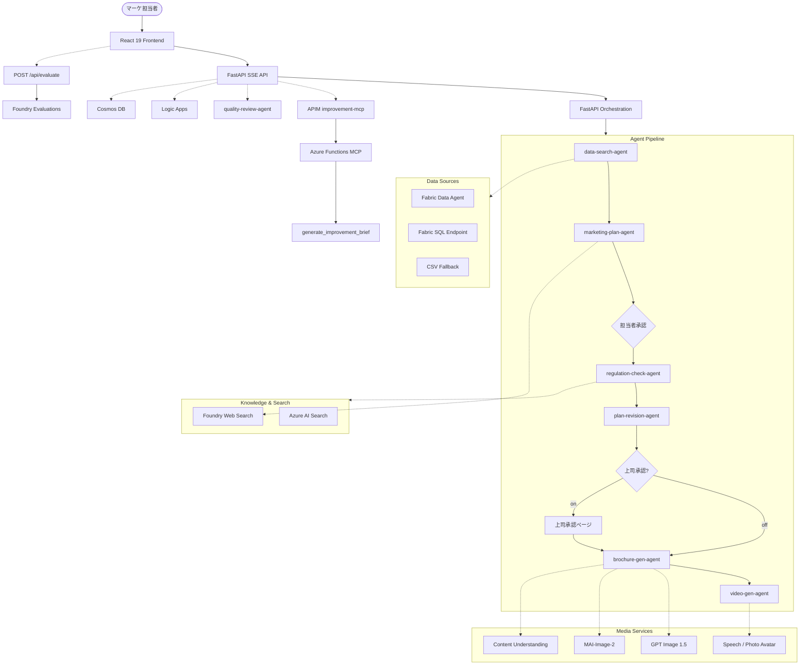
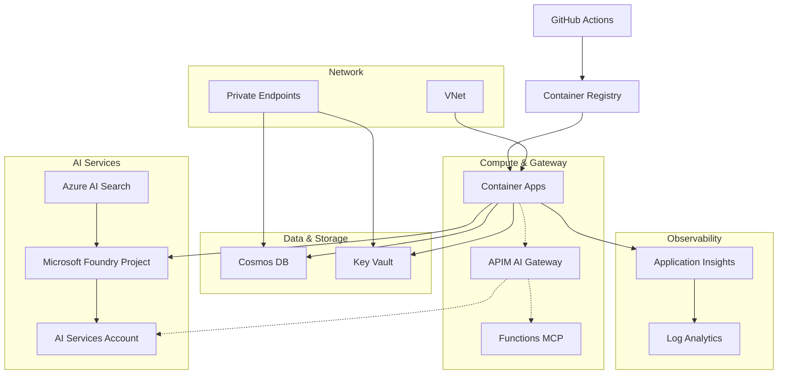

# Azure アーキテクチャ

現在の実装と Azure 実環境に基づくアーキテクチャ資料です。

## 1. ランタイム実行フロー

## 2. Azure リソース構成

## 3. IaC で作られるリソース

| リソース | 構成 |
| --- | --- |
| AI Services | `kind=AIServices`, `allowProjectManagement=true`, `disableLocalAuth=true`, `gpt-5-4-mini` 自動配備 |
| Foundry Project | `accounts/projects@2025-06-01` |
| Container Apps | System MI, health/readiness probe, 0–3 replicas |
| APIM | BasicV2, Managed Identity, AI Gateway policy |
| Azure Functions MCP | Flex Consumption, `mcp_server/` zip 配備 (postprovision) |
| Logic Apps | Consumption, HTTP trigger (post-approval actions) |
| Cosmos DB | Serverless, `disableLocalAuth=true`, Private Endpoint, RBAC |
| Key Vault | Private Endpoint, RBAC |
| Observability | Log Analytics + Application Insights |

## 4. postprovision 後の手動設定

| 項目 | 理由 |
| --- | --- |
| Azure AI Search + `regulations-index` 投入 | ナレッジベース検索に必要 |
| Foundry → AI Search 接続追加 | `get_default(ConnectionType.AZURE_AI_SEARCH)` が前提 |
| `FABRIC_DATA_AGENT_URL` | Agent1 が Fabric Data Agent を優先するため |
| `SPEECH_SERVICE_ENDPOINT` / `SPEECH_SERVICE_REGION` | Photo Avatar 動画生成 |
| `VOICE_SPA_CLIENT_ID` / `AZURE_TENANT_ID` | Voice Live MSAL.js 認証 |

上記以外の環境変数（`IMPROVEMENT_MCP_ENDPOINT`, `COSMOS_DB_ENDPOINT` 等）は `azd up` で自動注入されます。

## 5. 認証モデル

| 実行主体 | 認証方式 | 用途 |
| --- | --- | --- |
| Container App | `DefaultAzureCredential` | Foundry, Fabric, Cosmos DB, AI Search |
| APIM | Managed Identity | Foundry バックエンド接続 |
| AI Search bootstrap | Foundry connection or API key | 初期インデックス投入 |

Container App の MI には Bicep で Foundry 関連ロール, Cosmos DB Data Contributor, Key Vault Secrets User, AcrPull が付与されます。

## 6. Remote MCP

- 現在 Azure Functions MCP で提供するのは `generate_improvement_brief`（評価改善用）のみ
- 他のツールはエージェント内 `@tool` 実装
- 新規リモートツール追加時も、Functions MCP + APIM 公開 + FastAPI graceful fallback の同パターンを推奨
