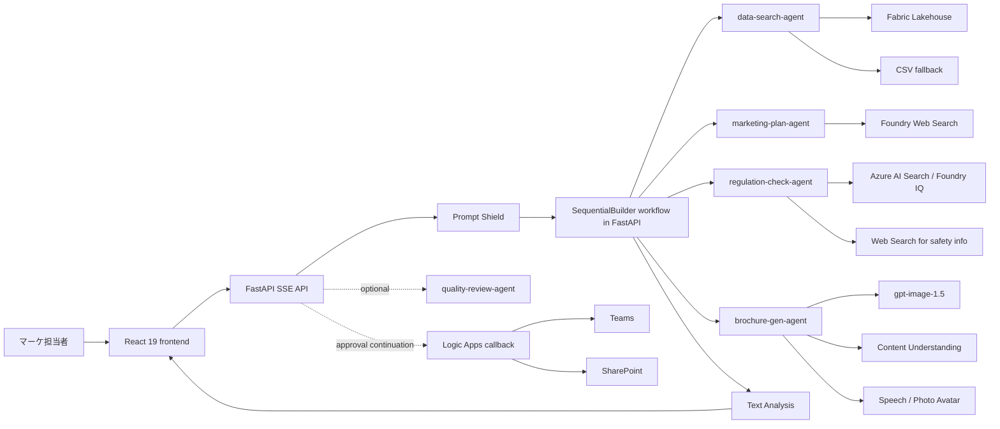
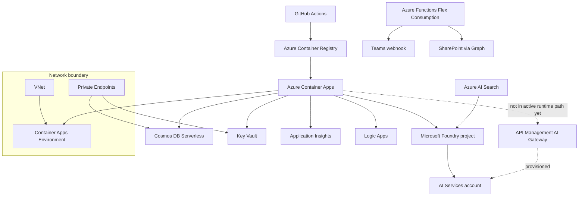

# Azure アーキテクチャ

このドキュメントは、要件書の理想構成ではなく、現在の実装と Azure 側の実配備前提をベースに整理したものです。

## 1. ランタイム実行フロー

## 2. Azure リソース構成

## 3. IaC で作られるもの

| リソース | 構成 |
|---|---|
| AI Services | `kind=AIServices`、`allowProjectManagement=true`、`disableLocalAuth=true`、`gpt-5-4-mini` を既定で配備 |
| Foundry project | `accounts/projects@2025-06-01` |
| Container Apps | System-assigned MI、`/api/health` と `/api/ready` の probe、0-3 レプリカ |
| APIM | BasicV2、Managed Identity、AI Gateway ポリシー、トークン制限とメトリクス発行 |
| Azure Functions | Flex Consumption、Python 3.13 |
| Logic Apps | Consumption、HTTP trigger ベース |
| Cosmos DB | Serverless、`disableLocalAuth=true`、Private Endpoint、RBAC |
| Key Vault | Private Endpoint、RBAC |
| Observability | Log Analytics + Application Insights |

## 4. IaC の後に手動で補う項目

| 項目 | 理由 |
|---|---|
| `gpt-image-1.5` の配備 | IaC は既定のテキストモデルのみ作成するため |
| Azure AI Search の作成と `regulations-index` の投入 | Foundry IQ の実データ検索に必要 |
| Foundry project と Azure AI Search の接続 | `search_knowledge_base()` の既定接続に必要 |
| `CONTENT_UNDERSTANDING_ENDPOINT` | PDF 解析ツールが参照 |
| `SPEECH_SERVICE_ENDPOINT` / `SPEECH_SERVICE_REGION` | Promo video 生成ツールが参照 |
| `LOGIC_APP_CALLBACK_URL` | 承認継続後の HTTP callback に必要 |
| `TEAMS_WEBHOOK_URL` / `SHAREPOINT_SITE_URL` | Functions 側の通知・保存補助ツールで使用 |

## 5. 認証モデル

| 実行主体 | 認証方式 | 主な用途 |
|---|---|---|
| FastAPI / Container App | `DefaultAzureCredential` | Foundry、Cosmos DB、Azure AI Search、Content Safety |
| APIM | Managed Identity | Foundry バックエンドへの認証 |
| Azure Functions | Function auth + Managed Identity | Storage、外部連携 |
| AI Search bootstrap script | Foundry 接続または API key | 初期インデックス投入 |

Container App の Managed Identity には、Bicep で Foundry 関連ロール、Cosmos DB Data Contributor、Key Vault Secrets User、AcrPull が割り当てられます。

## 6. 現在の実装メモ

- `POST /api/chat` の Azure モードは、FastAPI 内の `SequentialBuilder` を最後まで実行する構成です。
- APIM は Azure 側に作られますが、アプリケーション実行時のモデル呼び出しは現状 direct project endpoint です。
- `approval_request` SSE はモック / デモ経路と承認継続経路で利用されます。既定の Azure 実行経路では途中停止しません。
- 品質レビューは主フロー後の追加 `text` イベントとして返ります。主 workflow participant ではありません。
- Azure AI Search の実行時検索は Managed Identity ベースです。API キーはセットアップ用スクリプトの任意経路にだけ残っています。
